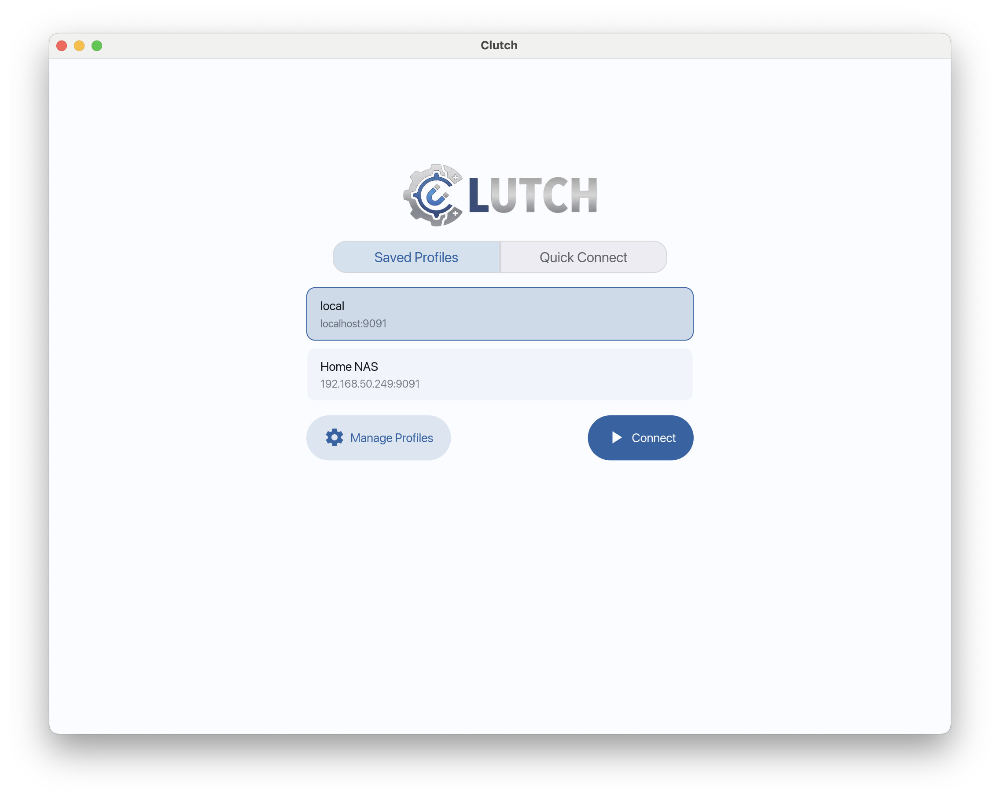
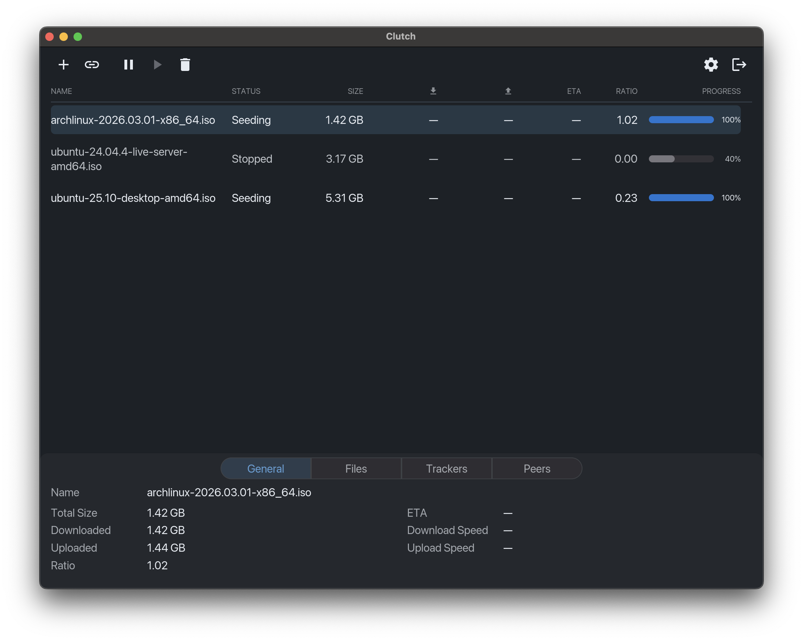
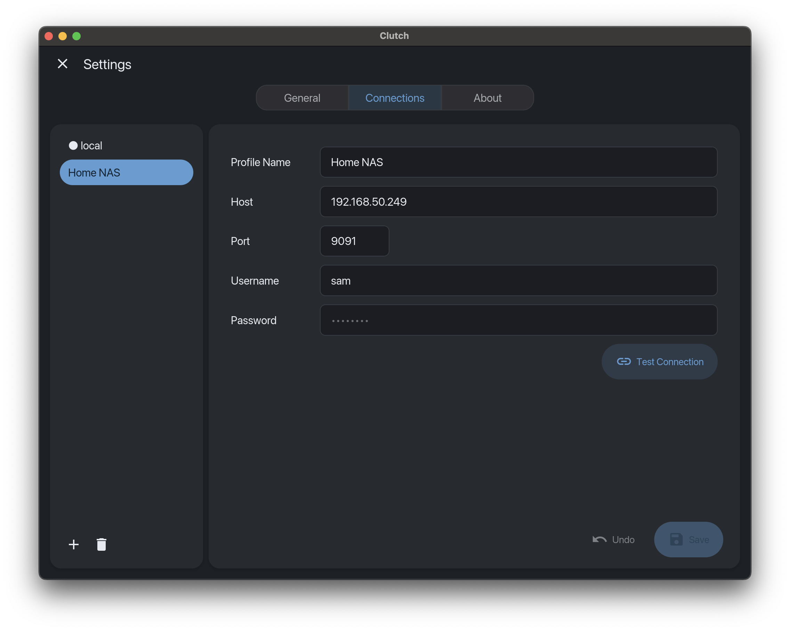

<p align="center">
  
</p>

<p align="center">
  <a href="https://github.com/shitz/clutch/actions/workflows/ci.yml"></a>
  <a href="https://github.com/shitz/clutch/releases/latest"></a>
</p>

<p align="center">
  
  
  
</p>

A modern, material design based desktop GUI for [Transmission](https://transmissionbt.com/) built in
Rust using [iced](https://github.com/iced-rs/iced). Connects to a remote Transmission daemon via its
JSON-RPC API.

## Features

- **Native & Lightweight** — Built in pure Rust using the `iced` GUI library. GPU-accelerated,
  cross-platform, and entirely free from web-view or Electron memory bloat.
- **Dynamic Filtering** — Multi-select filter chips allow you to quickly isolate torrents by state
  (Downloading, Seeding, Active, Paused, Error) with real-time counts.
- **Core Torrent Management** — Add (via magnet or file), start, pause, remove, and relocate torrent
  data on the remote daemon directly from a right-click context menu.
- **Detailed Inspector** — View tracker status, connected peers, and select specific files within a
  torrent for download.
- **Bulk Actions** — Select multiple torrents to start, pause, delete, or edit options across the
  entire selection simultaneously.
- **Multi-Torrent Add Queue** — Select multiple `.torrent` files at once for sequential addition,
  with the ability to cancel individual items or the entire queue.
- **Bandwidth Control** — Toggle global alternative speed limits (Turtle Mode) from the toolbar, or
  set strict per-torrent download, upload, and seeding ratio caps.
- **Queue Management** — Configure the daemon's download and seed queue limits from the settings
  panel, and reorder pending/downloading torrents via context menu actions.
- **Multiple Connection Profiles** — Save and switch between different remote Transmission instances
  seamlessly.
- **Secure Storage** — Daemon passwords are encrypted at rest using Argon2id and ChaCha20-Poly1305.
- **Material 3 Design** — Clean, responsive interface with light, dark, and system-follow themes,
  built from the ground up for desktop UX.

## Why

I wanted to create a modern, visually appealing, and highly responsive desktop client for managing
Transmission daemons. Clutch provides a native desktop experience designed around modern
Material 3 principles, without relying on heavy frameworks like Electron. Because it is written in
Rust and adheres to a strict asynchronous UI architecture, the interface remains completely
non-blocking and highly responsive, even when polling hundreds of torrents.

While Clutch does not yet aim to replicate every niche feature of a 15-year-old client it is
designed to handle the core remote management workflow flawlessly. It gives users a clean, secure,
and resource-efficient way to control their seedboxes and home servers.

### Clutch vs. TrguiNG

If you are exploring modern Transmission clients, you have likely come across
[TrguiNG](https://github.com/openscopeproject/TrguiNG), a feature-rich rewrite of Transgui built
with Tauri and React. Clutch and TrguiNG solve the same core problem but take fundamentally
different architectural approaches.

**You should choose Clutch if:**

- **UI performance is critical.** Clutch is written in pure Rust and renders directly via the GPU.
  By completely bypassing HTML, CSS, and the browser DOM, it uses a fraction of the memory and
  scrolls flawlessly under heavy load, even with thousands of torrents.
- **You prefer a clean, Material 3 design.** Clutch is built from the ground up to feel like a
  modern, uncluttered, and highly responsive desktop application.
- **You want a simple, straightforward experience.** Clutch is highly opinionated. It intentionally
  omits niche features to keep the core remote-management workflow simple and fast.
- **You manage a single seedbox at a time.** By skipping multi-tabbed concurrent connections, Clutch
  keeps its UI footprint and background network polling strictly focused and efficient.

**You should choose TrguiNG if:**

- **You need advanced features.** TrguiNG supports local torrent creation, label
  management, and tracker management.
- **You need concurrent multi-server management.** TrguiNG offers a multi-tabbed interface to
  connect to several daemons simultaneously.
- **You prefer a highly data-dense, enterprise-style UI.**

## Installation

Pre-built installers are attached to every [GitHub
Release](https://github.com/shitz/clutch/releases).

### macOS (Apple Silicon)

#### Homebrew

Add the tap and install via Homebrew:

```sh
brew tap shitz/clutch

brew install --cask clutch
```

**Gatekeeper workaround:** Because Clutch is unsigned, macOS will refuse to open it with an "app is
damaged" error. To bypass this, run the following command in Terminal after installing it via
Homebrew:

```sh
xattr -cr /Applications/Clutch.app
```

#### Manual

Download `Clutch_<version>_aarch64.dmg`, open it, and drag **Clutch.app** into your Applications
folder.

**Gatekeeper workaround:** Because Clutch is unsigned, macOS will refuse to open it with an "app is
damaged" error. To bypass this, run the following command in Terminal after dragging it to
Applications:

```sh
xattr -cr /Applications/Clutch.app
```

Then open it normally from Finder.

### Windows

Download `clutch_<version>_x64-setup.exe` and run it. Windows SmartScreen may show a blue warning —
click **More info** → **Run anyway**.

### Linux

#### AppImage (universal)

Download `clutch_<version>_x86_64.AppImage`, make it executable, and run it:

```sh
chmod +x clutch_<version>_x86_64.AppImage
./clutch_<version>_x86_64.AppImage
```

#### Debian/Ubuntu

```sh
sudo dpkg -i clutch_<version>_amd64.deb
```

### Build from source

Requires a [Rust toolchain](https://rustup.rs/) (stable).

```sh
git clone https://github.com/shitz/clutch.git
cd clutch
cargo run --release
```

## How it was built

Clutch was developed using a heavily AI-assisted workflow:

- Each feature was modelled as a structured specification using [OpenSpec](https://openspec.dev/),
  with design docs, specs, and task breakdowns tracked in the repository under `openspec/changes/`
  and `openspec/specs/`.
- Implementation was done almost entirely with **Claude Sonnet 4.6** as the coding agent.
- Code review was performed by **Gemini 3.1 Pro** and the author.

All OpenSpec artifacts (specs, changes, and archives) are included in this repository, so you can
trace the design rationale for any feature and get a full specification for each implemented change.

The architecture is documented in [system_architecture.md](system_architecture.md).

## Contributing

Bug reports and feature requests are welcome — please open an issue.

Pull requests are also welcome. A few ground rules:

- **Disclose AI use.** If a PR was built with AI assistance, say so: include the model(s) used, the
  prompts or agentic workflow, and any relevant context.
- **Bring specs for larger changes.** A non-trivial feature should come with the associated
  OpenSpec artifacts (design doc, spec, task list) so the intent is clear and reviewable.
- For smaller fixes and tweaks, a clear description of the problem and solution is enough.

## License

Clutch is licensed under the Apache License 2.0. See [LICENSE](LICENSE) for details.
